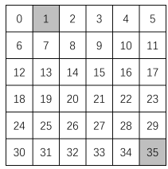

# Report of CS489 Project 1

## 0. Introduction

In this project, we are required to build the GridWorld environment and implement iterative policy evaluation method and policy iteration method. These are two methods based on Dynamic Programming.

## 1. GridWorld Environment

Literally, GridWorld is a grid. Each grid in it represents a state. There're terminal states and non-terminal states. In non-terminal states, we can move one grid to north, east, south and west.

<center>
    
    <br>
    <div style="color:orange; border-bottom: 1px solid #d9d9d9;
    display: inline-block;
    color: #999;
    padding: 2px;">Fig.1 GridWorld</div>
</center>

 We can build an MDP $\langle \mathcal{S}, \mathcal{A}, \mathcal{P}, \mathcal{R}, \gamma \rangle$ for GridWorld, in which we choose an random uniform policy.

- $\mathcal{S}$ is a finite set of states, here $\mathcal{S} = \{s_t|t\in 0,\cdots,35\}$, $s_1$ and $s_{35}$ are terminal states

- $\mathcal{A} = \{n,e,s,w\}$ which represents north, east, south and west move

- $\mathcal{P}$ is a state transition probability matrix where 
    $$
    \mathcal{P}_{ss'}^{a}=\mathbb{P}[S_{t+1}=s'|S_t=s,A_t=a]=1.0, \forall s\in \mathcal{S}-\{s_1,s_{35}\}, s'\in \mathcal{S},a\in\mathcal{A} \\
    \mathcal{P}_{ss'}^{a}=\mathbb{P}[S_{t+1}=s'|S_t=s,A_t=a]=0, \forall s\in \{s_1,s_{35}\},s'\in\mathcal{S}, a\in\mathcal{A}
    $$

- $\mathcal{R}$ is a reward function where
    $$
    \mathcal{R}_s^a=\mathbb{E}[R_{t+1}|S_t=s,A_t=a]=-1.0,\forall s\in \mathcal{S}-\{s_1,s_{35}\},a\in\mathcal{A} \\
    \mathcal{R}_s^a=\mathbb{E}[R_{t+1}|S_t=s,A_t=a]=0,\forall s\in \{s_1,s_{35}\},a\in\mathcal{A}
    $$

- $\gamma=1.0$ for it's a episodic task

- $\pi$ is the policy where
    $$
    \pi(a|s)=\mathbb{P}[A_t=a|S_t=s]=0.25, \forall a\in \mathcal{A}, s\in\mathcal{S}
    $$

And we can implement the GridWorld MDP in Python. The definition of data structures are shown as follows:

```python
class GridWorld:
    def __init__(self, state, terminalState, gamma, threshold):
        self.state = state #|S|
        self.terminalState = terminalState
        self.gamma = gamma #gamma
        self.threshold = threshold #theta

        self.value = []
        self.optimalPolicy = []
        self.policy = [] #pi[s][a]
        self.gridSize = int(math.sqrt(self.state))
        self.action = {'n' : 0, 'e' : 1, 's' : 2, 'w' : 3} #A
        self.trans = [[0 for j in range(len(self.action))] for i in range(self.state)] #s' = trans[s][a] 
        self.prob = [[[0.0 for k in range(self.state)] for j in range(len(self.action))] for i in range(self.state)] #P[s][a][s']
        self.reward = [[-1.0 for j in range(len(self.action))] for i in range(self.state)] #E[R[s][a]]
        self.map = [[(j + i * self.gridSize) for j in range(self.gridSize)] for i in range(self.gridSize)] #for calculating trans[s][a] and filling in P[s][a][s']
```

We can calculate $\mathcal{P}$ by invoking `self.__calcParam` and fill the probability 1.0 in the right place in `self.prob`. The policy `self.policy` will be initialized later.

## 2. Iterative Policy Evaluation

## 3. Policy Iteration

## 4. Value Iteration*

## 5. Summarize and Acknowledgement