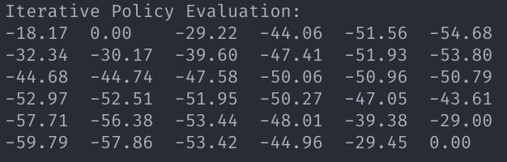
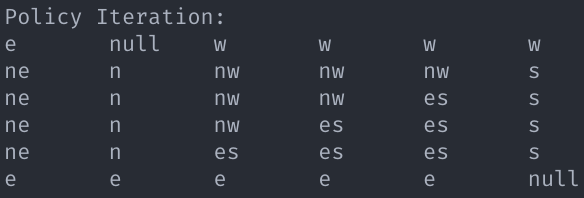
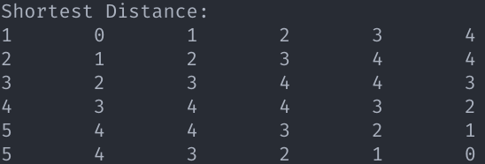

# Report of CS489 Project 1

## 0. Introduction

In this project, we are required to build the GridWorld environment and implement iterative policy evaluation method and policy iteration method. These are two methods based on Dynamic Programming.

## 1. GridWorld Environment

Literally, GridWorld is a grid. Each grid in it represents a state. There're terminal states and non-terminal states. In non-terminal states, we can move one grid to north, east, south and west.

<center>
    
    <br>
    <div style="color:orange; border-bottom: 1px solid #d9d9d9;
    display: inline-block;
    color: #999;
    padding: 2px;">Fig.1 GridWorld</div>
</center>

 We can build an MDP $\langle \mathcal{S}, \mathcal{A}, \mathcal{P}, \mathcal{R}, \gamma \rangle$ for GridWorld, in which we choose an random uniform policy.

- $\mathcal{S}$ is a finite set of states, here $\mathcal{S} = \{s_t|t\in 0,\cdots,35\}$, $s_1$ and $s_{35}$ are terminal states

- $\mathcal{A} = \{n,e,s,w\}$ which represents north, east, south and west move

- $\mathcal{P}$ is a state transition probability matrix where 
    $$
    \mathcal{P}_{ss'}^{a}=\mathbb{P}[S_{t+1}=s'|S_t=s,A_t=a]=1.0, \forall s\in \mathcal{S}-\{s_1,s_{35}\}, s'\in \mathcal{S},a\in\mathcal{A} \\
    \mathcal{P}_{ss'}^{a}=\mathbb{P}[S_{t+1}=s'|S_t=s,A_t=a]=0, \forall s\in \{s_1,s_{35}\},s'\in\mathcal{S}, a\in\mathcal{A}
    $$

- $\mathcal{R}$ is a reward function where
    $$
    \mathcal{R}_s^a=\mathbb{E}[R_{t+1}|S_t=s,A_t=a]=-1.0,\forall s\in \mathcal{S}-\{s_1,s_{35}\},a\in\mathcal{A} \\
    \mathcal{R}_s^a=\mathbb{E}[R_{t+1}|S_t=s,A_t=a]=0,\forall s\in \{s_1,s_{35}\},a\in\mathcal{A}
    $$

- $\gamma=1.0$ for it's a episodic task

- $\pi$ is the policy where
    $$
    \pi(a|s)=\mathbb{P}[A_t=a|S_t=s]=0.25, \forall a\in \mathcal{A}, s\in\mathcal{S}
    $$

And we can implement the GridWorld MDP in Python. The definition of data structures are shown as follows:

```python
class GridWorld:
    def __init__(self, state, terminalState, gamma, threshold):
        self.state = state #|S|
        self.terminalState = terminalState
        self.gamma = gamma #gamma
        self.threshold = threshold #theta

        self.value = []
        self.optimalPolicy = []
        self.policy = [] #pi[s][a]
        self.gridSize = int(math.sqrt(self.state))
        self.action = {'n' : 0, 'e' : 1, 's' : 2, 'w' : 3} #A
        self.trans = [[0 for j in range(len(self.action))] for i in range(self.state)] #s' = trans[s][a] 
        self.prob = [[[0.0 for k in range(self.state)] for j in range(len(self.action))] for i in range(self.state)] #P[s][a][s']
        self.reward = [[-1.0 for j in range(len(self.action))] for i in range(self.state)] #E[R[s][a]]
        self.map = [[(j + i * self.gridSize) for j in range(self.gridSize)] for i in range(self.gridSize)] #for calculating trans[s][a] and filling in P[s][a][s']
```

We can calculate $\mathcal{P}$ by invoking `self.__calcParam` and fill the probability 1.0 in the right place in `self.prob`. The policy `self.policy` will be initialized later.

## 2. Iterative Policy Evaluation

### 2.1 Implementation

The policy evaluation is easy to implement using the data structures we declared before. We need to iteratively calculate the Bellman Equation until converge. Thus, we can use the following equation to update our state value function $v(s)$
$$
v_{k+1}(s)= \sum_{a\in \mathcal{A}}\pi(a|s)(\mathcal{R}_s^a+\gamma\sum_{s'\in\mathcal{S}}\mathcal{P}_{ss'}^{a}v_k(s'))
$$
Before the iterative update of $v(s)$, we need to initialize $v(s)$ arbitrarily except $v(terminal)=0$. And here's my implementation of the iteration

```python
def evaluation(self):
        #Initialize
        ......
        k = 0
        #Loop
        while True:
            delta = 0.0
            for curState in range(self.state):
                oldValue = self.value[curState]
                newValue = 0.0
                for a in self.action.keys(): #GridWorld Specified
                    tmp = 0.0
                    #the inner sum disappeared
                    nextState = self.trans[curState][self.action[a]] #Only one element because here's GridWorld
                    tmp += self.prob[curState][self.action[a]][nextState] * self.value[nextState] #prob must be 1.0
                    newValue += self.policy[curState][self.action[a]] * (self.reward[curState][self.action[a]] + (self.gamma * tmp)) 
                self.value[curState] = newValue
                delta = max(delta, math.fabs(oldValue - self.value[curState]))
            k += 1
            if delta < self.threshold:
                break
```

As we can see, in the inner for-loop we are calculating $\mathcal{R}_s^a+\gamma\sum_{s'\in\mathcal{S}}\mathcal{P}_{ss'}^{a}v_k(s')$. However, due to the property of GridWorld, the sum over $s'\in\mathcal{S}$ has only one term. Thus, no another for-loop is needed.

### 2.2 Result

The algorithm on our GridWorld converges in about 300 iterations. And here's the result.

<center>
    
    <br>
    <div style="color:orange; border-bottom: 1px solid #d9d9d9;
    display: inline-block;
    color: #999;
    padding: 2px;">Fig.2 Iterative Policy Evaluation</div>
</center>

## 3. Policy Iteration

### 3.1 Implementation

The policy iteration based on Bellman optimality equation is used to improve a given policy. I tried the algorithm shown in the slide. However, the program fell into a infinite loop. I found it will never converge if I arbitrarily initialize the policy as a deterministic policy. It's because the initialization may generate a deterministic policy which never reaches the terminal states. I figured out two methods to tackle with this problem.

1. Remove the outer while-loop, which means evaluate only once
2. Use nondeterministic policy

According to  method 1, I rewrote the evaluation parts and it worked. It returned a optimal deterministic policy. However, I found there are some states which have more than one paths to the terminal states. It reminded me of method 2 and I modified the given algorithm. 

```Python
def policyIteration(self):
        #Initialize
        ......
        self.optimalPolicy = [[0, 1, 2, 3] for i in range(self.state)]
		......
        numPass = 0
        while True:
            #Loop
            ......

            #Policy Improvement
            policyStable = True
            for curState in range(self.state):
                oldAction = self.optimalPolicy[curState]
                newAction = []
                tmpValue = []
                maxValue = -1.0e9
                for a in self.action.keys():
                    nextState = self.trans[curState][self.action[a]] #Only one element because here's GridWorld
                    tmp = self.prob[curState][self.action[a]][nextState] * self.value[nextState] #prob must be 1.0
                    tmp = self.reward[curState][self.action[a]] + (self.gamma * tmp)
                    tmpValue.append(tmp)
                    if tmp > maxValue:
                        maxValue = tmp

                for i in range(len(tmpValue)):
                    if math.fabs(maxValue - tmpValue[i]) < 1e-9:
                        newAction.append(i)
                self.optimalPolicy[curState] = sorted(newAction)
                for a in self.action.keys():
                    if self.action[a] in newAction:
                        self.policy[curState][self.action[a]] = 1.0 / len(newAction)
                    else:
                        self.policy[curState][self.action[a]] = 0.0
                if oldAction != self.optimalPolicy[curState]:
                    policyStable = False
            if policyStable:
                break
            numPass += 1
```

In the initialization phase, we initialize the policy as the random uniform policy as before. Otherwise, we will still get stuck. Accordingly, we need to set each states in`self.optimalPolicy` as north, east, south and west. The evaluation phase remains the same as iterative policy iteration.

In the improvement phase, we find the action that maximize the state value and update the random uniform policy until the policy get stable.

### 3.2 Result

The algorithm converges faster than I estimated. The result is shown as: 

<center>
    
    <br>
    <div style="color:orange; border-bottom: 1px solid #d9d9d9;
    display: inline-block;
    color: #999;
    padding: 2px;">Fig.3 Policy Iteration</div>
</center>

Respectively, the shortest distances from each state to terminal states is:

<center>
    
    <br>
    <div style="color:orange; border-bottom: 1px solid #d9d9d9;
    display: inline-block;
    color: #999;
    padding: 2px;">Fig.4 Shortest Distance</div>
</center>

We can easily verify the correctness of the algorithm.

## 4. Value Iteration*

### 4.1 Implementation

### 4.2 Result

## 5. Summarize and Acknowledgement