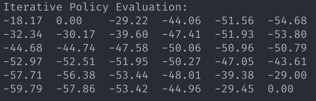
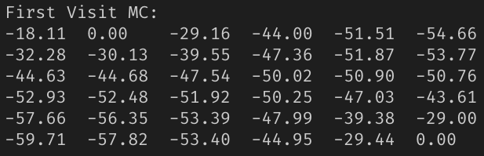
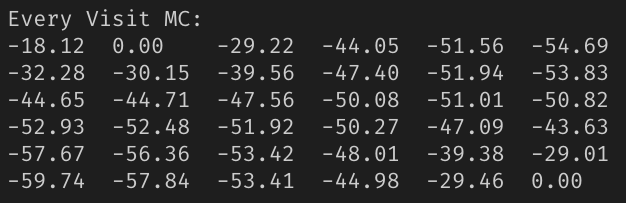
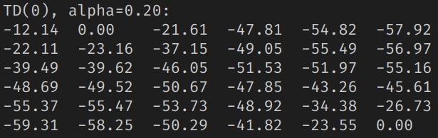
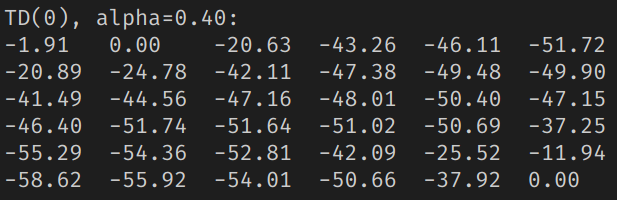
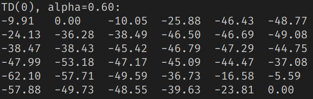
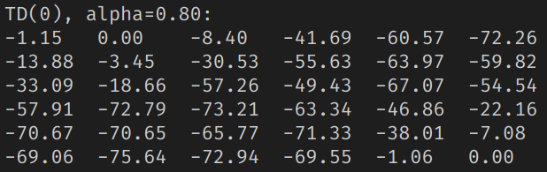

# CS489 Assignment 2 Report

517030910214 Hongzhou Liu

## 0. Introduction

In this assignment, we are required to implement Monte-Carlo (MC) Learning and Temporal-Difference (TD) Learning. These are two methods that can evaluate a given policy directly by learning from episodes of experience without knowledge of MDP model. We will still implement these methods based on GridWorld.

Environment:

- Ubuntu 18.04 LTS
- Python 3.7.4

We've already calculated true value of the given policy in last assignment. We consider it as a baseline.

<center>
    
    
    <br>
    <div style="color:orange; border-bottom: 1px solid #d9d9d9;
    display: inline-block;
    color: #999;
    padding: 2px;">Fig.1 Baseline</div>
</center>
## 1. Monte-Carlo Learning

### 1.1 Implementation

#### 1.1.1 First  Visit MC

MC can learn directly from episodes of experience. The idea behind it is quite simple, which regards average sample returns as value. According to law of large numbers, if we sample infinite episodes, the sample average returns is the true value.

In MC algorithm, we should first generate an episode under policy $\pi$. The policy here is still the random uniform policy. The code to generate an episode is shown as follows:

```python
def __episodeGenerator(self):
        episode = []
        episode.append(random.randint(0, 35))
        curState = episode[0]
        while curState not in self.terminalState:
            curAction = random.randint(0, 3)
            curReward = self.reward[curState][curAction]
            curState = self.trans[curState][curAction]
            episode.extend([curAction, curReward, curState])
        return episode
```

It's easy to implement as we've perfectly defined all the data structure needed.

In first visit MC, for a given episode and a state $s$ in the episode, we find the first time-step $t$ that it is visited in the episode. Then, we increment the counter $N(s)$ and update estimate value $V(s)$ incrementally by 
$$
V(s)\leftarrow V(s) + \dfrac{1}{N(s)}(G_t-V(s))
$$
where $G_t=R_{t+1}+\gamma R_{t+2} + \cdots + \gamma^{T-t-1}R_T$.

Notice that MC can only apply to episodic MDPs ($\gamma=1$). To solve the "first visit" problem, we use `visited`, a boolean array, to track if a state is visited in an episode. The code:

```python
def firstVisitMC(self, iterTime, alpha=1.0, useAlpha=False):
        #Initialize
        self.value = [0.0 for i in range(self.state)]
        counter = [0 for i in range(self.state)]
        visited = [False for i in range(self.state)]

        #Sample & Evaluate
        for i in range(iterTime):
            episode = self.__episodeGenerator()
            for j in range(0, len(episode), 3):
                curState = episode[j]
                if not visited[curState]:
                    visited[curState] = True
                    counter[curState] += 1
                    G = 0.0
                    decay = 1.0
                    for k in range(j + 2, len(episode), 3):
                        G += decay * episode[k]
                        decay *= self.gamma
                    if useAlpha:
                        self.value[curState] = self.value[curState] + alpha * (G - self.value[curState])
                    else:
                        self.value[curState] = self.value[curState] + (G - self.value[curState]) / counter[curState]
            visited = [False for i in range(self.state)]
```

As shown in the code, we use outer i-loop for different episode samples, middle j-loop for going through every states in the episode and inner k-loop for calculating return of a given first-visit state.

#### 1.1.2 Every Visit MC

The every visit MC algorithm can be implemented by deleting `visited` array and the if-statement in first visit MC. So the middle j-loop is now:

```python
        for j in range(0, len(episode), 3):
                curState = episode[j]
                counter[curState] += 1
                G = 0.0
                decay = 1.0
                for k in range(j + 2, len(episode), 3):
                    G += decay * episode[k]
                    decay *= self.gamma
                if useAlpha:
                    self.value[curState] = self.value[curState] + alpha * (G - self.value[curState])
                else:
                    self.value[curState] = self.value[curState] + (G - self.value[curState]) / counter[curState]
```

### 1.2 Result

We set `iterTime` for both MC algorithms as 10000000. And finally we got

<center>
    
    
    <br>
    <div style="color:orange; border-bottom: 1px solid #d9d9d9;
    display: inline-block;
    color: #999;
    padding: 2px;">Fig.2 First Visit MC</div>
</center>


<center>
    
    
    <br>
    <div style="color:orange; border-bottom: 1px solid #d9d9d9;
    display: inline-block;
    color: #999;
    padding: 2px;">Fig.3 Every Visit MC</div>
</center>

As we can see, the results of both MC after quantities of iterations are almost the true value. Thus, we can use MC to estimate a policy, despite that it is time consuming.

## 2. Temporal-Difference Learning

### 2.1 Implementation

TD can also learn directly from episodes of experience. However, unlike MC, TD learns from incomplete episodes and updates a guess towards a guess. It learns $v_{\pi}$ on-line from experience under policy $\pi$.

The simplest TD learning algorithm is TD(0). In every episodes, TD(0) randomly chooses a starting state $S$. Then, it samples an action under policy $\pi$, takes the action and observes next state $S'$ and reward $R$. After that, it will update $V(S)$ by
$$
V(S)\leftarrow V(S)+\alpha(R+\gamma V(S')-V(S))
$$
The episode will be ended if some action leads TD(0) to a terminal state.

According to these ideas, we can implement TD(0) in Python:

```python
def TD0(self, iterTime, alpha):
        #Initialize
        self.value = [random.random() for i in range(self.state)]
        for i in self.terminalState:
            self.value[i] = 0.0

        #Sample & Evaluate
        for i in range(iterTime):
            curState = random.randint(0, 35)
            while curState not in self.terminalState:
                curAction = random.randint(0, 3)
                curReward = self.reward[curState][curAction]
                nextState = self.trans[curState][curAction]
                self.value[curState] = self.value[curState] + alpha * (curReward + self.gamma * self.value[nextState] - self.value[curState])
                curState = nextState
```

### 2.2 Result

We can run TD(0) with different $\alpha$'s. And for each $\alpha$, we set `iterTime` as 10000000. Here's the results under different $\alpha$'s:

<center>
    
    
    <br>
    <div style="color:orange; border-bottom: 1px solid #d9d9d9;
    display: inline-block;
    color: #999;
    padding: 2px;">Fig.4 TD(0), alpha=0.2</div>
</center>


<center>
    
    
    <br>
    <div style="color:orange; border-bottom: 1px solid #d9d9d9;
    display: inline-block;
    color: #999;
    padding: 2px;">Fig.5 TD(0), alpha=0.4</div>
</center>


<center>
    
    
    <br>
    <div style="color:orange; border-bottom: 1px solid #d9d9d9;
    display: inline-block;
    color: #999;
    padding: 2px;">Fig.6 TD(0), alpha=0.6</div>
</center>


<center>
    
    
    <br>
    <div style="color:orange; border-bottom: 1px solid #d9d9d9;
    display: inline-block;
    color: #999;
    padding: 2px;">Fig.7 TD(0), alpha=0.8</div>
</center>

As we can see, the smaller the $\alpha$ is, the closer the result is to the real value. However, we can still use TD(0) to estimate a policy, because the "trend" of the value is the same as the "trend" of true value.

## 3. Summary

In this assignment, I implemented MC and TD(0) and had a better understand of model-free algorithms.