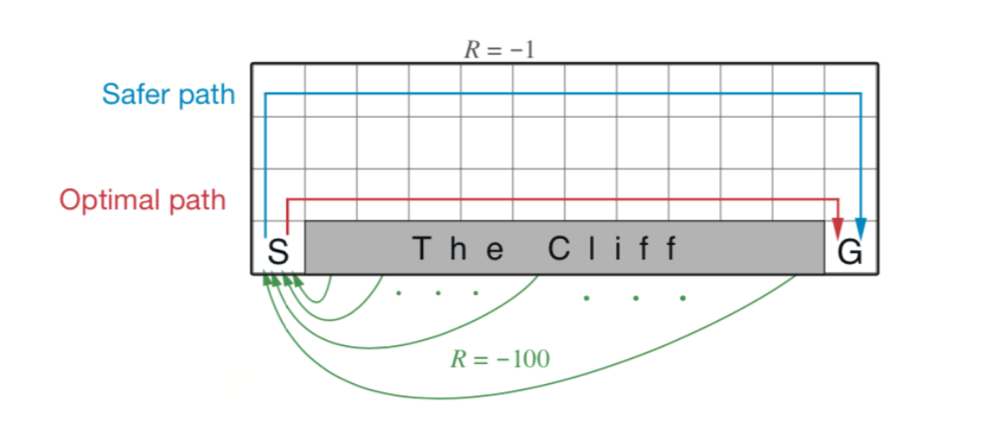
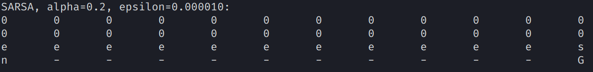
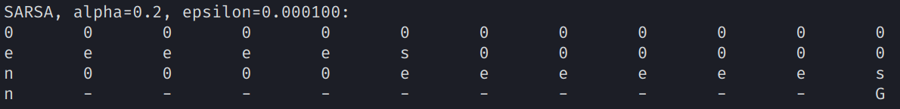
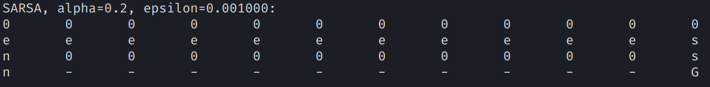
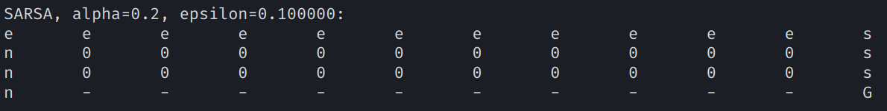
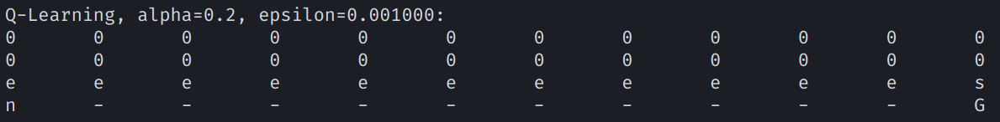
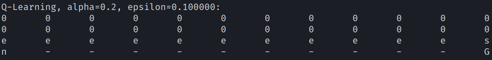

# CS489 Assignment 3 Report

517030910214 Hongzhou Liu

## 0. Introduction

In this assignment, we are required to implement SARSA and Q-Learning in CliffWalking environment. CliffWalking is a variant of GridWorld. In CliffWalking, the start state is specified and there's a cliff lying between start state and goal state. Once our agent moves onto the cliff, it slips directly to the start state and receives a reward of -100. In other case, a move will incur a reward of -1.

<center>
    
    <br>
    <div style="color:orange; border-bottom: 1px solid #d9d9d9;
    display: inline-block;
    color: #999;
    padding: 2px;">Fig.1 CliffWalking</div>
</center>


Environment:

- Ubuntu 18.04 LTS
- Python 3.7.7

It will take a few changes on our original GridWorld to convert it into CliffWalking. As the following code shows, once the agent step onto the cliff, it will be instantly sent to the start state and receives a reward  of -100.

```python
for cliffState in range(self.startState + 1, self.goalState):
            edgeState = self.trans[cliffState][self.action['n']]
            self.trans[edgeState][self.action['s']] = self.startState
            self.reward[edgeState][self.action['s']] = -100.0
        self.trans[self.startState][self.action['e']] = self.startState
        self.reward[self.startState][self.action['e']] = -100.0
```

## 1. SARSA

### 1.1 Implementation

We need to implement a method that calculates $\epsilon$-greedy policy and a method that generates an action from the policy.

The $\epsilon$-greedy policy is defined as
$$
\pi(a|s)=\left\{
        \begin{array}{cl}
          {1-\epsilon+\epsilon/|\mathcal{A}|} & {\text{if } a=\arg\max_{a}Q(s,a)} \\
          {\epsilon/|\mathcal{A}|} & {\text{otherwise}} \\
        \end{array}\right.
$$
Thus, we can implement it easily as:

```python
    def __updatePolicy(self, s, epsilon):
        optimalAction = np.argmax(self.QValue[s])
        for a in self.action.values():
            if a != optimalAction:
                self.policy[s][a] = epsilon / len(self.action)
            else:
                self.policy[s][a] = 1 - epsilon + epsilon / len(self.action)
```

In SARSA, we need to generate an action $A$ from $S$ using $\epsilon$-greedy policy derived from $Q$, which is totally different from generate an action from uniform random policy. In `__actionGenerator`, we divide $[0,1)$ into four intervals. The length of each interval corresponds to the policy value of state $s$ and action $a$. `accProb` is an array that stores the edge values of intervals. Then, we just need to throw a stone (`prob`) into the line $[0,1)$ and output the interval it falls into.

```python
    def __actionGenerator(self, s, epsilon):
        prob = random.random()
        accProb = [sum(self.policy[s][:i]) for i in range(len(self.action) + 1)]
        for i in range(len(self.action)):
            if prob >= accProb[i] and prob < accProb[i + 1]:
                a = i
        return a
```

At last, we can implement SARSA, the code is shown as

```python
    def SARSA(self, alpha, epsilon, iterTimes):
        #Initialize
        self.QValue = [[random.random() for j in range(len(self.action))] for i in range(self.state)]
        self.policy = [[0.0 for j in range(len(self.action))] for i in range(self.state)]
        for a in self.action.values():
            self.QValue[self.goalState][a] = 0.0
        for s in range(self.state):
            self.__updatePolicy(s, epsilon)

        #Iteration
        for _ in range(iterTimes):
            curState = self.startState
            curAction = self.__actionGenerator(curState, epsilon)
            while curState != self.goalState:        
                nextState = self.trans[curState][curAction]
                curReward = self.reward[curState][curAction]
                nextAction = self.__actionGenerator(nextState, epsilon)
                self.QValue[curState][curAction] = self.QValue[curState][curAction] + alpha * (curReward + self.gamma * self.QValue[nextState][nextAction] - self.QValue[curState][curAction])
                self.__updatePolicy(curState, epsilon)
                curState = nextState
                curAction = nextAction
```

In the initialize part, we should initialize Q-value and generate a policy from it. Then, the code follows the SARSA algorithm to update Q-value. Also, we should always update our policy after the update of Q-value.

### 1.2 Result

We run SARSA with different $\epsilon$'s. The result differs when we feed it in with different $\epsilon$'s.

<center>
    
    <br>
    <div style="color:orange; border-bottom: 1px solid #d9d9d9;
    display: inline-block;
    color: #999;
    padding: 2px;">Fig.2 SARSA, epsilon=0.00001</div>
</center>

<center>
    
    <br>
    <div style="color:orange; border-bottom: 1px solid #d9d9d9;
    display: inline-block;
    color: #999;
    padding: 2px;">Fig.3 SARSA, epsilon=0.0001</div>
</center>

<center>
    
    <br>
    <div style="color:orange; border-bottom: 1px solid #d9d9d9;
    display: inline-block;
    color: #999;
    padding: 2px;">Fig.4 SARSA, epsilon=0.001</div>
</center>

<center>
    
    <br>
    <div style="color:orange; border-bottom: 1px solid #d9d9d9;
    display: inline-block;
    color: #999;
    padding: 2px;">Fig.5 SARSA, epsilon=0.1</div>
</center>

## 2. Q-Learning

### 2.1 Implementation

### 2.2 Result

<center>
    
    <br>
    <div style="color:orange; border-bottom: 1px solid #d9d9d9;
    display: inline-block;
    color: #999;
    padding: 2px;">Fig.6 Q-Learning, epsilon=0.001</div>
</center>

<center>
    
    <br>
    <div style="color:orange; border-bottom: 1px solid #d9d9d9;
    display: inline-block;
    color: #999;
    padding: 2px;">Fig.7 Q-Learning, epsilon=0.1</div>
</center>

## 3. Summary