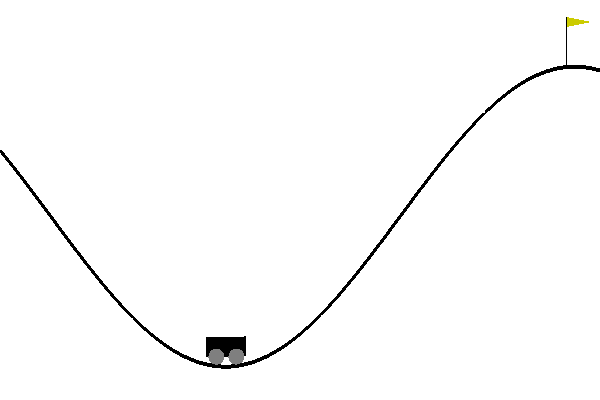

# CS489 Assignment 4 Report

517030910214 Hongzhou Liu

## 0. Introduction

In this assignment, I implemented DQN and it's improvement Double DQN in MountainCar environment. In MountainCar, there's a car on a one-dimension track. The goal is to drive up the mountain on the right. Due to the limitation of engine, the car have to drive back and forth to build up momentum in order to reach the goal. There are three kinds of actions: 

- 0: push left
- 1: do nothing
- 2: push right

Each time the car choose an action, it will gain a reward of -1. The state observed by agent from the environment consists of current horizontal position and velocity. The goal is at the position of 0.5. An episode ends when the car reaches the goal or the car takes 200 actions.

    
     
    
Fig.1 Mountain Car

Environment:

- Ubuntu 18.04 LTS
- Python 3.7.7

## 1. DQN

### 1.1 Implementation

#### 1.1.1 Algorithm

Deep Q-Network is a milestone of Reinforcement Learning. It introduced neural network into the original Q-Learning algorithm and largely strengthened the ability of Q-Learning algorithm. The two features of DQN is:

- Fixed target net
- Replay buffer

The DQN algorithm starts with policy network $Q$ and target network $\hat{Q}$, which is the same. In each episode, the agent interact with the environment using the given state $s_t$ and an action $a_t$ based on $Q$ epsilon greedily. The algorithm stores the obtained reward $r_t$ and next state $s_{t+1}$ together with $s_t$ and $a_t$ into the buffer as $(s_t,a_t,r_t,s_{t+1})$. Then, it samples a batch from the buffer and estimate the target as
$$
y=r+\gamma\max_a\hat{Q}(s,a)
$$
Then, we will optimize the mean square error between the estimation and Q value as
$$
\min(y-Q(s,a))^2
$$
The algorithm fixes the target network $\hat{Q}$ and updates the policy network $Q$. And it will update $\hat{Q}$ by setting $\hat{Q}:=Q$ every $C$ steps.

#### 1.1.2 Network

We will utilize `torch.nn` to construct our neural network for DQN.

#### 1.1.? Some Discussions

### 1.2 Result

## 2. Double DQN

### 2.1 Implementation

### 2.2 Result

