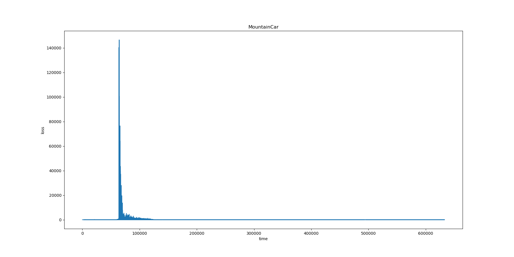

# CS489 Assignment 4 Report

517030910214 Hongzhou Liu

## 0. Introduction

In this assignment, I implemented DQN and it's improvement Double DQN in MountainCar environment. In MountainCar, there's a car on a one-dimension track. The goal is to drive up the mountain on the right. Due to the limitation of engine, the car have to drive back and forth to build up momentum in order to reach the goal. There are three kinds of actions: 

- 0: push left
- 1: do nothing
- 2: push right

Each time the car choose an action, it will gain a reward of -1. The state observed by agent from the environment consists of current horizontal position and velocity. The goal is at the position of 0.5. An episode ends when the car reaches the goal or the car takes 200 actions.

<center>
    
    <br>
    <div style="color:orange; border-bottom: 1px solid #d9d9d9;
    display: inline-block;
    color: #999;
    padding: 2px;">Fig.1 Mountain Car</div>
</center>

Environment:

- Ubuntu 18.04 LTS
- Python 3.7.7

## 1. DQN

### 1.1 Implementation

#### 1.1.1 Algorithm

Deep Q-Network is a milestone of Reinforcement Learning. It introduced neural network into the original Q-Learning algorithm and largely strengthened the ability of Q-Learning algorithm. The two features of DQN is:

- Fixed target net
- Replay buffer

The DQN algorithm starts with policy network $Q$ and target network $\hat{Q}$, which is the same. In each episode, the agent interact with the environment using the given state $s_t$ and an action $a_t$ based on $Q$ epsilon greedily. The algorithm stores the obtained reward $r_t$ and next state $s_{t+1}$ together with $s_t$ and $a_t$ into the buffer as $(s_t,a_t,r_t,s_{t+1})$. Then, it samples a batch from the buffer and estimate the target as
$$
y=r+\gamma\max_a\hat{Q}(s,a)
$$
Then, we will optimize the mean square error between the estimation and Q value as
$$
\min(y-Q(s,a))^2
$$
The algorithm fixes the target network $\hat{Q}$ and updates the policy network $Q$. And it will update $\hat{Q}$ by setting $\hat{Q}:=Q$ every $C$ steps.

#### 1.1.2 Network

We will utilize `torch.nn` to construct our neural network for DQN.

```python
class DQN(nn.Module):
    def __init__(self, inputSize, hiddenSize, outputSize):
        super(DQN, self).__init__()
        self.fc1 = nn.Linear(inputSize, hiddenSize)
        self.fc2 = nn.Linear(hiddenSize, hiddenSize)
        self.fc3 = nn.Linear(hiddenSize, outputSize)

    def forward(self, x):
        x = F.leaky_relu(self.fc1(x))
        x = F.leaky_relu(self.fc2(x))
        x = F.leaky_relu(self.fc3(x))
        return x
```

Here, we construct a network with one hidden layer. And in this assignment, the size of the hidden layer is 256. We use leaky ReLU to avoid gradient vanishing. The input is state and the output is $Q(s,a)$ for each action $a$.

#### 1.1.3 Replay Buffer

The replay buffer is like memory in our brain. It stores some recent experience in tuple $(s_t,a_t,r_t,s_{t+1})$. The size of the buffer is fixed, meaning it will forget as it interacts with the environment.

```python
class ReplayBuffer:
    def __init__(self, capacity):
        self.capacity = capacity
        self.buffer = []
        self.position = 0 #for recursive array
        
    def push(self, *args):
        if len(self.buffer) < self.capacity:
            self.buffer.append(None)
        self.buffer[self.position] = Exp(*args)
        self.position = (self.position + 1) % self.capacity

    def sample(self, batchSize):
        return random.sample(self.buffer, batchSize)
```

We can implement the buffer as a recursive array. If the buffer is full, the newly coming experiences will replace the old ones. Also, we can use `sample` method to sample a batch of experiences.

#### 1.1.4 Optimize Object Function

The kernel of Deep Q-Learning is to optimize the mean-squared error between $Q$ and the estimation $y$. When implementing this part, some coding tricks are used.

```python
    def optimzeDQN(self, buf):
        if len(buf) < self.batchSize:
            print("Can't fetch enough exp!")
            return
        exps = buf.sample(self.batchSize)
        batch = Exp(*zip(*exps))  # batch => Exp of batch
        stateBatch = torch.cat(batch.state) # batchSize * stateSpace.shape[0]
        actionBatch = torch.cat(batch.action) # batchSize * 1
        rewardBatch = torch.cat(batch.reward) # batchSize * 1
        nextStateBatch = torch.cat(batch.nextState) # batchSize * stateSpace.shape[0]
        doneBatch = torch.cat(batch.done) # batchSize * 1

        Q = self.net(stateBatch).gather(1, actionBatch)  # get Q(s_t, a)
        targetQ = self.targetNet(nextStateBatch).max(1)[0].view(-1, 1) # max_a Q'(s_t+1, a)
        y = (targetQ * self.gamma) * doneBatch + rewardBatch
        loss = F.mse_loss(Q, y)
        estQMean = np.mean(targetQ.detach().cpu().numpy())

        self.optimizer.zero_grad()
        loss.backward()
        self.optimizer.step()
        return loss.item(), estQMean
```

After sampling a batch of experiences from buffer, we should separate the batches of $s_t$, $a_t$, $r_t$ and $s_{t+1}$ from the experience batch. Here, `zip()` function and `*` operator helps us reshape the batch and construct a new named tuple.

When calculating $Q$, `gather(1, actionBatch)` helps to find $Q(s,a)$ according to `actionBatch` as indices. And `max(1)[0]` to get $\max_a\hat{Q}(s,a)$. Notice that $y$ is slightly different when $s_t$ is the last state of an episode. `doneBatch` consists of flags indicating if $s_t$ is of such state. We multiply it on $\gamma \max_a\hat{Q}(s,a)$ to make sure $y=r_t$ if $s_t$ is the last state.

#### 1.1.5 Learning

```python
def DeepQLearning(self, env, buf, episodeNum, ifDecay=True):
        totalN = 0
        scores = []
        steps = []
        losses = []
        Qmeans = []
        self.targetNet.load_state_dict(self.net.state_dict())
        for i in range(episodeNum):
            score = 0.0
            rewardDecay = 1.0
            state = env.reset()
            for t in count():
                env.render()
                action = self.getAction(torch.tensor(state.reshape(1, self.stateSize), device=device, dtype=torch.float))
                
                nextState, reward, done, _ = env.step(action.item())
                
                buf.push(torch.tensor(state.reshape(1, self.stateSize), device=device, dtype=torch.float),
                          action,
                          torch.tensor([[reward]], device=device, dtype=torch.float),
                          torch.tensor(nextState.reshape(1, self.stateSize), device=device, dtype=torch.float),
                          torch.tensor([[not done]], device=device, dtype=torch.long))
                state = nextState
                score += rewardDecay * reward
                rewardDecay *= self.gamma
                
                loss, mean = self.optimzeDQN(buf)
                losses.append(loss)
                Qmeans.append(mean)
                
                if ifDecay:
                    self.epsilonDecay(totalN)
                totalN += 1
                
                if totalN % self.updateStride == 0:
                    self.targetNet.load_state_dict(self.net.state_dict())
                    
                if done or t + 1 >= env.max_episode_steps:
                    scores.append(score)
                    steps.append(t + 1)
                    print("Episode %d ended after %d timesteps with score %f, epsilon=%f" % (i + 1, t + 1, score, self.epsilon))
                    break
```

As seen, in the `for` loop, the DQN algorithm is properly implemented.  And `self.getAction` implements epsilon greedy.

#### 1.1.6 Some Discussions

##### Epsilon Decay

The local minimum problem might occurs when we fixed the epsilon at a relatively low value because the agent might not gain abundant experience in it's buffer. In this circumstance, the ability of exploration is limited and the agent may always choose a sub-optimal way because it has not gained experience which leads to the optimal way. Because we will not absolutely ban the exploration (epsilon > 0), the agent may find the optimal way in some episodes. However, those experiences only made a few portion in the agent's memory. But, epsilon decay can help to get close to the optimal and eliminate the fluctuate of the result.

Thus, I make the epsilon slowly decay from 1.0 (fully random policy) to 0.01. Also, I allowed the agent randomly explore the environment for 50000 steps.

```python
def epsilonDecay(self, N):
        if (N >= 50000):
            self.epsilon = self.EPS_END + (self.EPS_START - self.EPS_END) * math.exp(-1.0 * (N - 50000) / self.EPS_DECAY)
```

The result will be shown in later parts.

##### Customize Reward

I used the original reward function given by `gym` at first:
$$
reward(s)=-1,\forall s
$$
As mentioned, an episode will be ended if the car reach the goal or it take 200 actions. However, I found the car may never get to the goal. Because even the car is randomly explore the environment, it will accidentally reach the goal with a quite low probability. Also, the car will not know where to go because the reward is identical. It will stuck in an "optimal solution" and never reach the goal.

Thus, I modified the reward by unwrapping the `gym`  environment and re-wrapping it. The new reward function is:
$$
reward(s)=\begin{equation}
\left\{
	\begin{array}{lc}
	 -1 &\text{if }s \text{ is not the goal}\\
	 100 &\text{if }s \text{ is the goal}
	\end{array}
\right.
\end{equation}
$$
Also, I set the maximum step to 100000 to avoid the non-stop episode and increase the probability of a goal-reached episode. In this case, the rate of epsilon decaying should be more slower than before and we should let the agent to memorize more experience. If we train the DQN for enough episodes, it will find the optimal solution (the way to reach the goal in least steps). However, the convergence is too slow and I have to find another reward function to accelerate this process.

The state $s$ consists of current horizontal position and velocity, which reminds me of the concepts of mechanical energy. I found the function to calculate current vertical position according to horizontal position in the source code of `gym`. Thus, the reward function can be defined as
$$
reward(s)=\begin{equation}
\left\{
	\begin{array}{lc}
	 (h_s-0.1)\times 10+v_s^2\times 50 &\text{if }s \text{ is not the goal}\\
	 1000 &\text{if }s \text{ is the goal}
	\end{array}
\right.
\end{equation}
$$
I decreased the maximum step to 500. And in this case, the DQN will converge quite fast in about 200 episodes (using epsilon decay). However, the steps the car takes to reach the goal fluctuates around about 120 and will not always reach the optimal steps (around 85). The modified reward function is implemented as:

```python
def step(self, action):
        state, reward, done, info = self.env.step(action)
        if done:
            reward = 1000
        else:
            reward = (self.height(state[0]) - 0.1) * 10 + 50 * state[1] * state[1]
        return state, reward, done, info
    
    def height(self, xs):
        return np.sin(3 * xs) * .45 + .55
```

I also found a quite interesting phenomenon. If I provide another 10 rewards for the agent each time it reaches $x\ge x_{goal}-0.1$. Everything would be fine in the first 1000 episodes. However, after about 1000 episodes the car will not reach the goal, instead it wiggles next to the goal. It shows that even the epsilon is in a low rate, the agent will still explore the environment in a small range. Also, it reminds me that we should train the DQN a little longer to make sure a stable result.

### 1.2 Result & Discussion

I did experiment under the following setting of hyper-parameters:

| Hyper-parameter            | Value  |
| -------------------------- | ------ |
| max steps                  | 500    |
| replay buffer capacity     | 100000 |
| hidden layer size          | 256    |
| batch size                 | 128    |
| discount $\gamma$          | 0.99   |
| start epsilon $\epsilon_0$ | 1.0    |
| end epsilon $\epsilon_t$   | 0.01   |
| decay rate                 | 20000  |
| learning rate $\alpha$     | 0.001  |
| network update stride $C$  | 10     |
| total training episodes    | 5000   |

The following pictures shows the training process of DQN.

As seen, the car starts to reach the goal after about 200 episodes. After about 500 episodes, the steps to reach the goal starts "stably" fluctuate around about 110. However, there are still some outliers. And the agent may not always stays around the optimal (about 85 steps). Those are because the agent is still exploring with a little probability. But, the buffer is full of the experience of sub-optimal (110 steps), the probability that the steps decrease is low. The trend of discounted return is due to the same cause of the trend of steps.

<center>
    
    <br>
    <div style="color:orange; border-bottom: 1px solid #d9d9d9;
    display: inline-block;
    color: #999;
    padding: 2px;">Fig.2 DQN step</div>
</center>

<center>
    
    <br>
    <div style="color:orange; border-bottom: 1px solid #d9d9d9;
    display: inline-block;
    color: #999;
    padding: 2px;">Fig.3 DQN return</div>
</center>
The curve of training loss tells us the DQN got converged after 120000 steps of interactions with the environment.


<center>
    
    <br>
    <div style="color:orange; border-bottom: 1px solid #d9d9d9;
    display: inline-block;
    color: #999;
    padding: 2px;">Fig.4 DQN training loss</div>
</center>
After training, I randomly generate some states from the observation space and feed them into the net, trying to visualize the policy we learned. As we can see, when the velocity is negative driving the car away from the goal, the agent will choose "left" to accelerate and get to a higher position. And when the velocity is positive, it will choose "right" trying to gain faster to reach the goal. However, when the car get close the goal (position = 0.5), the behavior reversed. I guess it's because the car is trying its best to avoid falling back ($v<0$) or exceeding the goal ($v>0$) which never happens.


<center>
    
    <br>
    <div style="color:orange; border-bottom: 1px solid #d9d9d9;
    display: inline-block;
    color: #999;
    padding: 2px;">Fig.5 DQN policy</div>
</center>

## 2. Double DQN

### 2.1 Implementation

The double DQN is an improvement of natural DQN algorithm. It modified the method of estimating TD target and helps reduce overestimating of Q value greatly. The modified estimating of TD target is 
$$
y=r+\gamma\hat{Q}(s,\arg\max_a Q(s,a))
$$
Now,

- If $Q$ overestimate $a$, then $\hat{Q}$ will give it a proper value
- If $\hat{Q}$ overestimate $a$, then $a$ will not be selected

Thus, we can avoid overestimation in this way.

To implement Double DQN, we can just modify the `optimizeDQN` function and change the part of calculating $Q$ and $y$ as

```python
Q = self.net(stateBatch).gather(1, actionBatch)  # get Q(s, a)
        targetAction = self.net(nextStateBatch).max(1)[1].view(-1, 1)  # get argmax Q'(s_t+1, a)
        targetQ = self.targetNet(nextStateBatch).gather(1, targetAction)
        y = (targetQ * self.gamma) * doneBatch + rewardBatch
        loss = F.mse_loss(Q, y)
        estQMean = np.mean(targetQ.detach().cpu().numpy())
```

As seen, now we use $\arg\max\hat{Q}(s_{t+1},a)$ as the action batch when estimating `targetQ`. Here, `max(1)[1]` is used to get the index of maximum value in a row of a tensor in two dimensions.

### 2.2 Result & Discussion

I trained Double DQN under the same setting of hyper-parameters as in training DQN. The training results shows slightly different from DQN. As seen, the step got stably fluctuating around about 105 after 450 episodes and the Double DQN got converged after about 120000 steps.

<center>
    
    <br>
    <div style="color:orange; border-bottom: 1px solid #d9d9d9;
    display: inline-block;
    color: #999;
    padding: 2px;">Fig.6 DDQN step</div>
</center>

<center>
    
    <br>
    <div style="color:orange; border-bottom: 1px solid #d9d9d9;
    display: inline-block;
    color: #999;
    padding: 2px;">Fig.7 DDQN return</div>
</center>

<center>
    
    <br>
    <div style="color:orange; border-bottom: 1px solid #d9d9d9;
    display: inline-block;
    color: #999;
    padding: 2px;">Fig.8 DDQN training loss</div>
</center>
The visualization of policy on the trained network seems different from DQN policy. In the region $v\in[-0.07,-0.04], x\in[0.3,0.5]$, the car chooses "left" and in the region $v\in[0.04,0.07], x\in[0.25,0.5]$, the car chooses "right". This means Double DQN learned that whether the velocity is high or low around the goal does not matter. Instead, it will accelerate to acquire high reward.


<center>
    
    <br>
    <div style="color:orange; border-bottom: 1px solid #d9d9d9;
    display: inline-block;
    color: #999;
    padding: 2px;">Fig.9 DQN policy</div>
</center>
To compare the differences between DQN and Double DQN. I tested the trained DQN and Double DQN for 1000 episodes and calculated the average discounted return as the true value of Q. Then put the true value of Q and actual Q value during training together, then I got the following chart. As we can see, the actual Q value of DQN and Double DQN seems in the same range when they get flattened. But the actual Q value of Double DQN becomes a bit lower than it of DQN after about 450000 steps. Also, the true value of Double DQN seems slightly higher than the average actual Q value and the true value of DQN seems close to the average actual Q value of DQN. In Double DQN, the net does not overestimate the true value, instead the true value "overestimated" the Q value. It also proves that in Double DQN, the agent will get higher score than in DQN.

<center>
    
    <br>
    <div style="color:orange; border-bottom: 1px solid #d9d9d9;
    display: inline-block;
    color: #999;
    padding: 2px;">Fig.10 DQN VS DDQN</div>
</center>

However, the differences between the result of DQN and the results of Double DQN is not so large as I thought and the class taught. Double DQN for sure produced a slightly different policy from DQN. But I cannot see a large gap between the Q value between DQN and Double DQN during training. I think it partly due to the following reasons:

- Reward function: I observed that the value of discounted return is not strictly monotonic increasing according to the total steps to reach the goal. The use of mechanical energy as reward surely decreased the converging time greatly. However, it also greatly affects the Q value and the final solution.
- Hyper-parameters: I used the same hyper-parameter setting as in DQN. We may get a better performance if we tune those hyper-parameters. And in this setting Double DQN may perform as good as DQN and the differences are not so great.

