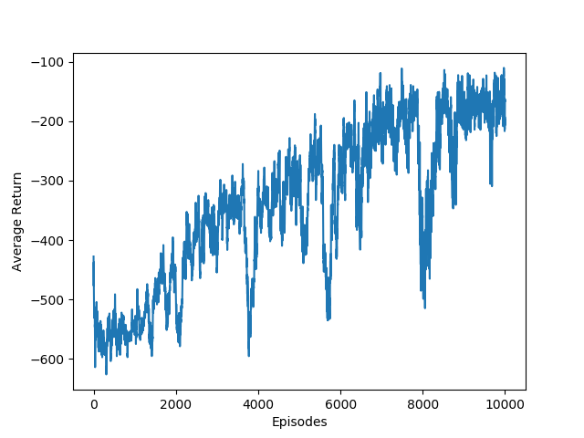

# CS489 Assignment 4 Report

517030910214 Hongzhou Liu

## 0. Introduction

In this assignment, I implemented A3C in Pendulum evironment.

    
     
    
Fig.1 Pendulum

Environment:

- Ubuntu 18.04 LTS
- Python 3.7.7

## 1. A3C

### 1.1 Algorithm

### 1.2 Implementation

#### 1.2.1 Network

#### 1.2.2 Parallel Learning

## 2. Result & Discussion

    
     
    
Fig.2 Result

    
     
    
Fig.3 Moving Average of Episode Returns

