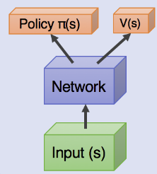
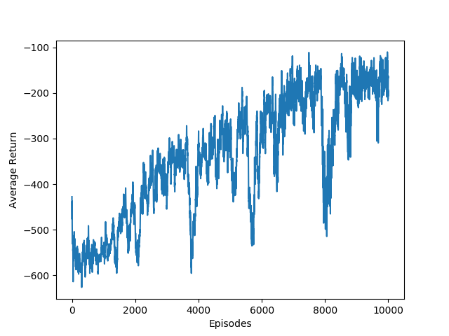
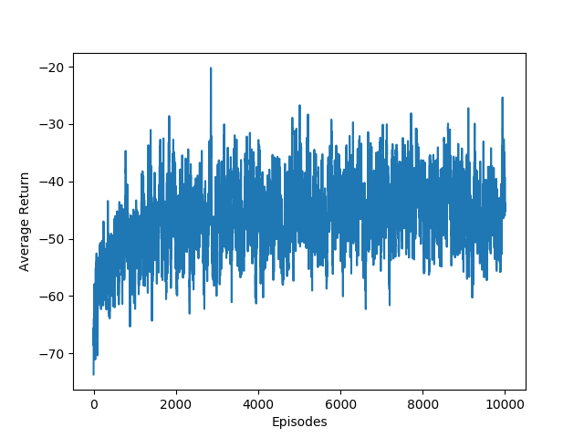

# CS489 Assignment 5 Report

517030910214 Hongzhou Liu

## 0. Introduction

In this assignment, I implemented A3C in Pendulum environment. In the Pendulum environment, our aim is to keep a frictionless pendulum standing up. The only way to control the pendulum is to apply force on the joint. Thus, the action space consists of only joint effort which is in the range of [-2.0, 2.0]. The observation consists of the sine and cosine value of current angle $\theta$ and angular velocity $\dot{\theta}$. The reward function is 
$$
-(\theta^2 + 0.1 \times \dot{\theta}^2 + 0.001 \times action^2)
$$
It reflects our goal, which is to keep the pendulum standing up ($\theta=0$) with least angular velocity and joint effort. In this environment, the termination is not specified and I set the maximum number of steps as 200.

<center>
    
    <br>
    <div style="color:orange; border-bottom: 1px solid #d9d9d9;
    display: inline-block;
    color: #999;
    padding: 2px;">Fig.1 Pendulum</div>
</center>

Environment:

- Ubuntu 18.04 LTS
- Python 3.7.7

## 1. A3C

### 1.1 Algorithm

Asynchronous Advantage Actor-Critic (A3C) is a improved algorithm of original Actor-Critic algorithm which can be used to train an agent with continuous action space. A3C consists of 3 basic ideas:

- Actor-Critic

    AC algorithms take the advantages of both Q-learning and Policy Gradient. The network estimates both value function $V(s)$ and policy $\pi(s)$. The value function is seen as critic and  the policy is the actor.

- Advantage

    In Policy Gradient algorithm, the update rule used the discounted returns from an episode in order to tell the agent which of its actions are good and which are bad. The network will be updated in order to encourage and discourage actions appropriately.

- Asynchronous

    There are multiple agents called workers who interact with environment. Each worker has its own network and parameters. There is a global network and each work will update the global network asynchronously. Such method works better than having a single agent (A2C) due to the diversity of experiences.

The algorithm will first initialize the global network and start all workers. A worker will reset gradients $d\theta$, $d\theta_v=0$ at the beginning of each episode and then interacts with environment and record states, actions and rewards. After a certain steps, it will calculate the return values of each states then calculate value and policy losses and optimize the global network using the accumulated gradient of both losses by
$$
d\theta \leftarrow d\theta + \nabla_{\theta'}\log \pi(a_i|s_i;\theta')(R-V(s_i;\theta_v')) 
$$

$$
d\theta_v\leftarrow d\theta_v + \partial(R-V(s_i;\theta_v'))^2/\partial\theta_v'
$$

where $\theta'$ and $\theta_v'$ are local parameters. Then, the algorithm will perform asynchronous update of global parameters $\theta$ and $\theta_v$ using $d\theta$ and $d\theta_v$ respectively. The algorithm will terminate after a number of steps or episodes.

### 1.2 Implementation

#### 1.2.1 Network

We need to separate the output of our network into 2 parts, one for actor, the other for critic. As we can see in the following figure, the two outputs may share some parameters.

<center>
    
    <br>
    <div style="color:orange; border-bottom: 1px solid #d9d9d9;
    display: inline-block;
    color: #999;
    padding: 2px;">Fig.2 Network</div>
</center>

In my network, they are totally divided except for the input layer, which mean there are an actor network and a critic network.

```python
class ACNet(nn.Module):
    def __init__(self, inputSize, hiddenSize, outputSize):
        super(ACNet, self).__init__()
        self.actor1 = nn.Linear(inputSize, hiddenSize)
        self.mu = nn.Linear(hiddenSize, outputSize)
        self.sigma = nn.Linear(hiddenSize, outputSize)

        self.critic1 = nn.Linear(inputSize, hiddenSize)
        self.value = nn.Linear(hiddenSize, 1)

        for l in [self.actor1, self.mu, self.sigma, self.critic1, self.value]:
            self._initLayer(l)

        self.distribution = torch.distributions.Normal
        
    def _initLayer(self, layer):
        nn.init.normal_(layer.weight, mean=0.0, std=0.1)
        nn.init.constant_(layer.bias, 0.0)
        
    def forward(self, x):
        actor1 = F.relu6(self.actor1(x))
        mu = 2 * torch.tanh(self.mu(actor1))
        sigma = F.softplus(self.sigma(actor1)) + 0.001
        critic1 = F.relu6(self.critic1(x))
        value = self.value(critic1)
        return mu, sigma, value
```

The policy $\pi(s)$ is actually a probabilistic distribution. Here, we assume it's a Gaussian distribution and the network learns it's mean and variance. As for the critic $V(s)$, we use a network with single hidden layer and outputs it's value directly. The choice of activation functions refers to [1](https://github.com/MorvanZhou/pytorch-A3C/blob/master/continuous_A3C.py). I also defined loss function like

```python
    def loss(self, state, action, R):
        self.train()
        mu, sigma, value = self.forward(state)
        error = R - value
        critic_loss = error.pow(2)
        dist = self.distribution(mu, sigma)
        log_prob = dist.log_prob(action)
        entropy = 0.5 + 0.5 * math.log(2 * math.pi) + torch.log(dist.scale)
        actor_loss = -(log_prob * error.detach() + 0.005 * entropy)
        return (critic_loss + actor_loss).mean()
```

It's almost the same as the original loss function in the paper. However, I added an entropy term in actor loss to enable a few explorations.

We also need to select actions during training. It's quite difficult from what we do in DQN. Here, the policy is probabilistic instead of a deterministic one. Thus, we need to sample from the distribution generated from the outputs of the neural network.:

```python
    def selectAction(self, state):
        self.training = False
        with torch.no_grad():
            mu, sigma, _ = self.forward(state)
            dist = self.distribution(mu.detach(), sigma.detach())
            return dist.sample().numpy()
```

To train the global network and local networks, we also need to modify the optimization method.

```python
class SharedAdam(optim.Adam):
    def __init__(self, params, lr=1e-3, betas=(0.9, 0.99), eps=1e-8, weight_decay=0):
        super(SharedAdam, self).__init__(params, lr=lr, betas=betas, eps=eps, weight_decay=weight_decay)
        for group in self.param_groups:
            for p in group['params']:
                state = self.state[p]
                state['step'] = 0
                state['exp_avg'] = torch.zeros_like(p.data)
                state['exp_avg_sq'] = torch.zeros_like(p.data)

                state['exp_avg'].share_memory_()
                state['exp_avg_sq'].share_memory_()
```

The `SharedAdam` make some of its parameters shared thus can be used in A3C.

#### 1.2.2 Parallel Learning

We need to utilize `multiprocessing` provided by `torch` to make a bunch of workers learn while interacting with the environment. A single process is implemented as follows.

```python
class Worker(mp.Process):
    def __init__(self, rank, globalNet, localNet, optimizer, totalEpisode, globalReturn, Q, params):
        super(Worker, self).__init__()
        self.rank = rank
        self.env = gym.make('Pendulum-v0').unwrapped
        self.GNet = globalNet
        self.LNet = localNet
        self.opt = optimizer
        self.totEps = totalEpisode
        self.totR = globalReturn
        self.Q = Q
        self.params = params
```

Here, `LNet` is the local network of this work. `totEps` and `totR` are variables resides in the shared memory space. We can use them to record some information among workers. `Q` is a queue which can been seen as another segment of memory that some workers can put data into it and other workers can get those data from it. `params` are some hyper parameters.

The training process is implemented in `run` function that will be executed after the parent process called `workerProcess.start()`. And our A3C algorithm is implemented in this part.

```python
    def run(self):
        steps = 1
        while self.totEps.value < self.params['MAX_EPISODE']:
            stateBuf, actionBuf, rewardBuf = [], [], []
            state = self.env.reset()
            ret = 0.0
            rewardDecay = 1.0

            for t in range(self.params['MAX_STEP']):
                if self.rank == 0:
                    self.env.render()
                action = self.LNet.selectAction(torch.from_numpy(state.reshape(1, -1).astype(np.float32)).to(device))
                nextState, reward, done, _ = self.env.step(action.clip(-2, 2))
                if t == self.params['MAX_STEP'] - 1:
                    done = True
                ret += rewardDecay * reward
                rewardDecay *= self.params['gamma']
                stateBuf.append(state.reshape(-1))
                actionBuf.append(action)
                rewardBuf.append((reward + 8.1) / 8.1)

                if steps % self.params['UPDATE_STRIDE'] == 0 or done:
                    self.learn(nextState, done, stateBuf, actionBuf, rewardBuf)
                    stateBuf, actionBuf, rewardBuf = [], [], []

                    if done:
                        with self.totEps.get_lock():
                            self.totEps.value += 1
                        with self.totR.get_lock():
                            if self.totR.value == 0:
                                self.totR.value = ret
                            else:
                                self.totR.value = self.totR.value * 0.9 + ret * 0.1
                        self.Q.put(self.totR.value)
                        print("Rank: %d\tEps: %d\tTotRet: %f"%(self.rank, self.totEps.value, self.totR.value))
                        break
                
                state = nextState
                steps += 1
        self.Q.put(None)
        self.env.close()
```

So, we will interact with the environment for `MAX_EPISODE` episodes totally. In an episode (inner `for` loop), the worker interacts with the environment and record state, action and reward. Each `UPDATE_STRIDE` steps, the worker updates the global network and local network by calling `learn`. When an episode terminates, we need to update the global counter `totEps` and record the moving average of global return value. We add lock because there is a critical section.

In the `learn` function, we calculate gradients and update networks.

```python
    def learn(self, nextState, done, stateBuf, actionBuf, rewardBuf):
        if done:
            R = 0
        else:
            R = self.LNet.forward(torch.from_numpy(nextState.reshape(1, -1).astype(np.float32)).to(device))[-1][0].item()
        
        RBuf = []
        for r in rewardBuf[::-1]:
            R = r + self.params['gamma'] * R
            RBuf.append(R)
        RBuf.reverse()

        loss = self.LNet.loss(
            torch.from_numpy(np.vstack(stateBuf).astype(np.float32)).to(device),
            torch.from_numpy(np.vstack(actionBuf).astype(np.float32)).to(device),
            torch.from_numpy(np.array(RBuf).reshape(-1, 1).astype(np.float32)).to(device)
        )
        self.opt.zero_grad()
        loss.backward()
        torch.nn.utils.clip_grad_norm_(self.LNet.parameters(), 20)
        for l, g in zip(self.LNet.parameters(), self.GNet.parameters()):
            g._grad = l.grad
        self.opt.step()

        self.LNet.load_state_dict(self.GNet.state_dict())
```

We first calculate the return (Q) values for each states in this period of experience. Then calculate the loss function and perform backpropagation. After it, the gradients is calculated by `torch` and we can copy them to the global network and perform update using `opt.step()`. At last, we update local network by copying parameters from the global network directly.

The final A3C implementation is shown as:

```python
class A3C:
    def __init__(self, gamma, updateStride, maxEps, maxSteps, hiddenSize, lr):
        self.params = {'MAX_EPISODE': maxEps, 'MAX_STEP': maxSteps, 'UPDATE_STRIDE': updateStride, 'gamma': gamma, 'hiddenSize': hiddenSize}
        self.env = gym.make('Pendulum-v0').unwrapped
        self.globalNet = ACNet(self.env.observation_space.shape[0], hiddenSize, self.env.action_space.shape[0]).to(device)
        self.globalNet.share_memory()
        self.opt = SharedAdam(self.globalNet.parameters(), lr=lr, betas=(0.95, 0.999))
        self.totEps = mp.Value('i', 0)
        self.totR = mp.Value('d', 0.0)
        self.Q = mp.Queue()
    
    def train(self):
        workers = [Worker(rank, self.globalNet,
                          ACNet(self.env.observation_space.shape[0], self.params['hiddenSize'], self.env.action_space.shape[0]).to(device),
                          self.opt,
                          self.totEps,
                          self.totR,
                          self.Q,
                          self.params)
                          for rank in range(mp.cpu_count())]
        
        [w.start() for w in workers]
        res = []
        while True:
            r = self.Q.get()
            if r is not None:
                res.append(r)
            else:
                break
        [w.join() for w in workers]
```

Notice that we have to make the parameters of global network shared using `globalNet.share_memory()`. In the `train()`, we need to first `start` all the workers then get some useful data using queue and at last, `join` those workers.

## 2. Result & Discussion

After training for about 10000 episodes, we can keep the pendulum standing up once an episode starts. Wherever the pendulum is initialized, our algorithm will spin it up to the right position and apply small efforts to keep its balance. I will provide the network parameters. And you can test it using `test()` defined in the code.

<center>
    
    <br>
    <div style="color:orange; border-bottom: 1px solid #d9d9d9;
    display: inline-block;
    color: #999;
    padding: 2px;">Fig.3 Result</div>
</center>
However, it's not easy to train A3C. During my training process, I found the following problems:

1. Hyper parameter & initialization sensitivity
2. Instability
3. Cannot utilize CUDA

For the first problem, here are my final hyper parameter settings:

| Hyper Parameter                     | Value  |
| ----------------------------------- | ------ |
| number of workers                   | 8      |
| max steps per episode               | 200    |
| hidden layer size of actor network  | 256    |
| hidden layer size of critic network | 256    |
| discount $\gamma$                   | 0.99   |
| learning rate $\alpha$              | 0.0001 |
| global network update stride        | 20     |
| total training episodes             | 10000  |

I found that when the stride of updating global network is 5 or 10, the algorithm will hit the best episode return value of about -100 in 4000 episodes. However, after 5000 episodes, the performance dropped sharply and fell back to around -600, which is the same as it in the beginning of training. It is probably due to the short sight effect when using little experience to adjust the global network. When I set the stride to 20, it seemed the problem solved. However, it will cost more time to train, as you can see in the following figure, we first hit -100 after 7000 episodes. We also don't know if the performance will drop if we train it for more episodes. Also, if the initialization has some problem, we have to re-train it. Sometimes, the moving average return will fluctuate around -600 and the network learns a bad policy. But sometimes, we will get the result in Fig. 4.

<center>
    
    <br>
    <div style="color:orange; border-bottom: 1px solid #d9d9d9;
    display: inline-block;
    color: #999;
    padding: 2px;">Fig.4 Moving Average of Episode Returns</div>
</center>

As mentioned it's a bit slow to train A3C, so I reduced $\gamma$ from 0.99 to 0.9 and recorded the moving average discounted return value.

<center>
    
    <br>
    <div style="color:orange; border-bottom: 1px solid #d9d9d9;
    display: inline-block;
    color: #999;
    padding: 2px;">Fig.5 Moving Average of Episode Returns, gamma=0.9</div>
</center>
I used discounted return , so the curve seems a bit messy and instable. However, you can observe that in Fig. 5, it converged in about 1500 episodes. After that point, the result fluctuates around -45 and the Pendulum can always stand up. So, the value of $\gamma$ also affects the result a lot.

For the second problem, in Fig.4, you can observe some valleys in the curve. Those valleys show that the random policy always has the problem of instability especially in the circumstance that a little randomness will lead to a huge failure. If we sample the distribution, we cannot avoid sampling some outliers and make the situation worse. Fortunately, in the most of time, it will sample the right thing and thus can lead to a good result. So, I think we DDPG may perform better in Pendulum environment due to its deterministic property.

For the last problem, it's hard to run multiple workers (processes) and put all the local network to GPU. It will incur the memory allocation failure due to the memory limitation of my GPU. So, I just train those networks in CPU and, fortunately, A3C with Pendulum is not hard to run and I got good results.

### 3. Acknowledgement

When implementing my A3C algorithm, I referred to the following GitHub repositories, which helped me a lot. I learned the network structure, the loss function and also coding techniques using `torch` from those codes.

- https://github.com/MorvanZhou/pytorch-A3C

- https://github.com/ikostrikov/pytorch-a3c